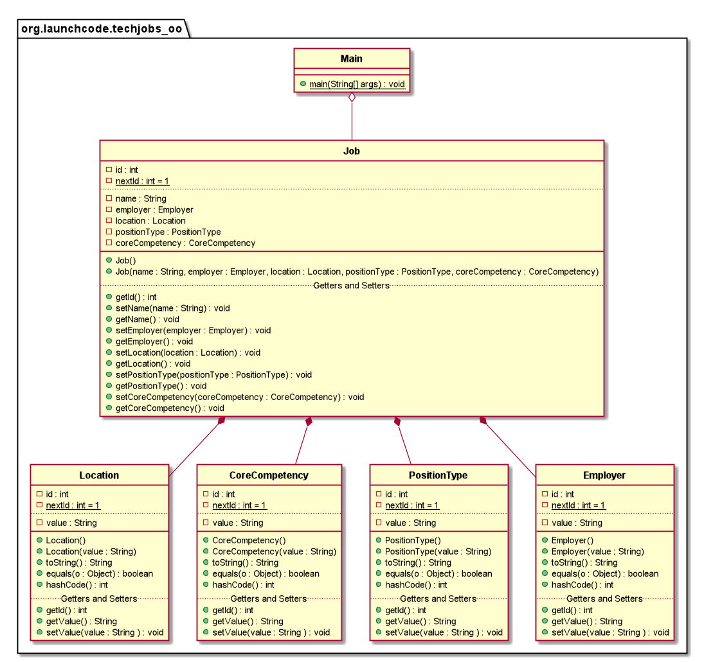

# Java Web Development - TechJobs OO

Well, here's a rare instance. A README.md file in a LaunchCode project.

You're in for a treat this time!

If you have the PlantUML Integration plugin on IntelliJ IDEA, you'll be able to see the UML Class Diagram I made for this.

---
 Java Web Development TechJobs OO by <a xmlns:cc="http://creativecommons.org/ns#" href="https://www.launchcode.org/" property="cc:attributionName" rel="cc:attributionURL">The LaunchCode Foundation</a> is licensed under a <a rel="license" href="http://creativecommons.org/licenses/by-nc-sa/4.0/">Creative Commons Attribution-NonCommercial-ShareAlike 4.0 International License</a>.
