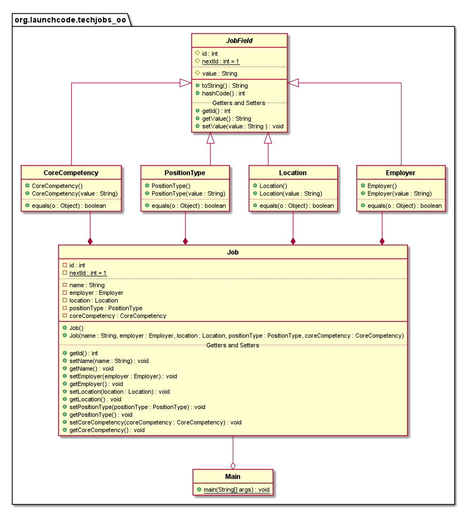

# About this folder

Howdy, stranger.

Are you like me? Did you need some help when you transitioned from TypeScript to Java?

Want to know a secret? All this can be done in TypeScript. Seriously. (Well, I haven't quite figured out how to get Angular involved, but maybe I'll add that to one of the other projects.)

This directory will pretty much follow the same path as the files in `/src/org.launchcode.techjobs_oo`, but will be written in TypeScript.



There were a few things that were not covered in Unit 1 of LC101. The files in this folder should rectify that, especially if you want to use TypeScript (and eventually Angular) in your capstone project.

I've decided to change the `CoreCompetency` class to `Skill`. (You'ld wish they had done this sooner.)

I also decided to use the `Map` object in `toString()` in the `Job` class in `Job.ts`.
This was an important structure that was not covered in LC101 Unit 1 that is a must know when you start to use `HashMap`s in Java in LC101 Unit 2.

I wrote something on how to use **Maps** in [this document](./Maps.md). Take a look on how it compares to JavaScript and Java.

Also, when you compile TypeScript, you will need to either create a `tsconfig.json` file ( which can be created using `tsc --init`) to set the `lib` variable to support a newer version of ECMAScript (like ES2017) and the DOM library.  You'll see this below in the compiling instructions.

My code might not be perfect, but does try to the best of my ability to try to recreate the same experience in another language.

Good Luck!

## Compile instructions

```bash
tsc --lib es2019,dom JobField.ts    // Compile JobField
tsc --lib es2019,dom Employer.ts    // Compile Employer
tsc --lib es2019,dom Location.ts    // Compile Location
tsc --lib es2019,dom Position.ts    // Compile PositionType
tsc --lib es2019,dom Skill.ts       // Compile Skill
tsc --lib es2019,dom Main.ts        // Compile Main
node Main.js                        // Run the program
```